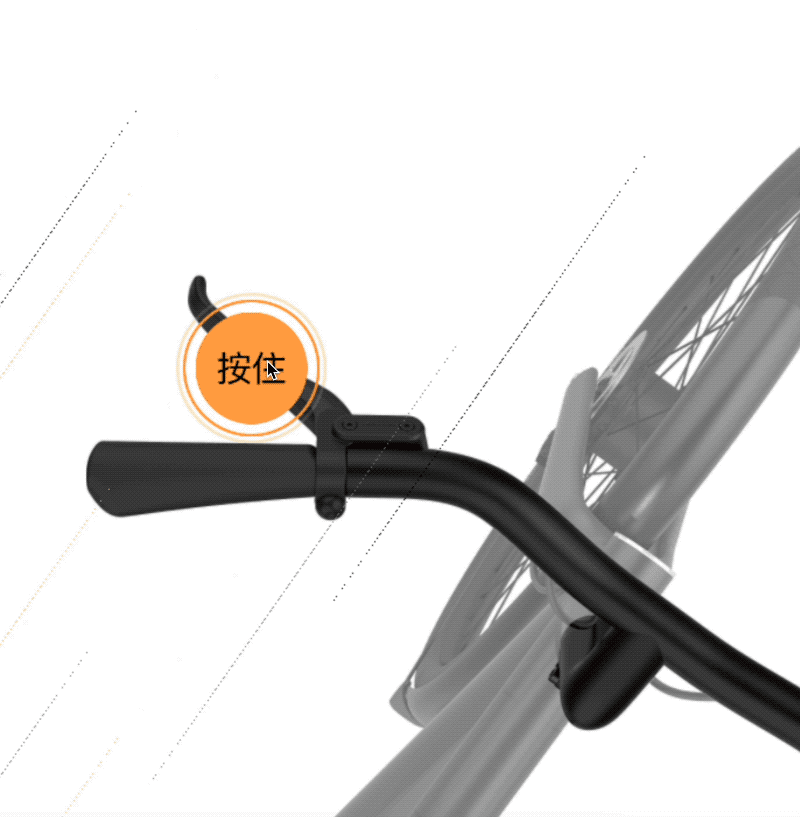

# The brake of vanmoof
brake:刹车
> B站开发回放: [https://www.bilibili.com/video/BV1q34y1n7dA](https://www.bilibili.com/video/BV1q34y1n7dA)
>
> 案例source: [https://www.vanmoof.com/](https://www.vanmoof.com/en-NL/s3?color=dark)
>
> git source: [https://github.com/ezshine/YCY-TrainingCamp-S1](https://github.com/ezshine/YCY-TrainingCamp-S1)

## 相关文档
- PIXI：https://pixijs.com/
- GSAP：https://greensock.com/docs/v3/GSAP

## 预览

